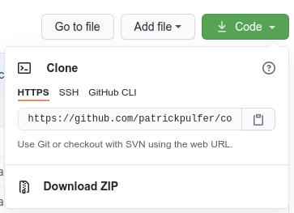

# Patrick's Covid19 Tracker

A simplified tracker for Covid-19 related news from reputable sources, aimed to provide non-convulated and up-to-date data for the masses

## Features

- World Map - Visual representation of Covid-19 data with mouse hover for further details
- Data Dable - In-depht representation of Covid-19 data, including current infections, hospitalization and vaccinations

### Features Left to Implement

- Visual graphs displaying trendings and historical data on Covid-19 infections

## Technologies Used

This application has been built by using the following technologies:

- [HTML 5](https://www.w3.org/TR/2008/WD-html5-20080122/) / [CSS](https://www.w3.org/Style/CSS/Overview.en.html) / [JavaScript](https://262.ecma-international.org/10.0/index.html)
- [JQuery](https://jquery.com)
  - Simplified DOM manipulation.
- [Font Awesome](https://fontawesome.com/)
  - Iconic SVG, font, and CSS framework.
- [Bootstrap](https://getbootstrap.com/)
  - Front-end framework for web development.
- [Google Charts](https://developers.google.com/chart)
  - Google API to draw charts via JavaScript
- [jQuery DataTables](https://datatables.net/)
  - Plug-in for the jQuery Javascript library for interactive tables

## API's consumed

- [Mediastack](https://mediastack.com/)
  - Free API for Live News & Blog Articles
- [Our World in Data API](https://github.com/owid/covid-19-data)
  - COVID-19 dataset collection from various reputable sources, including WHO Vaccine Tracker & Johns Hopkins University

## Development

If you are curious on the process of the development of this project, please [click here](./documentation/development.md).

## Deployment

### Current Deployment

The website is currently available at:

- [PWeb Solutions (my own hosting)](http://www.pweb.solutions/covidtracker/)
- [GitPages](https://patrickpulfer.github.io/code_institute_Interactive_Frontend_Development_Milestone_Project/index.html)
- [GitHack](https://raw.githack.com/patrickpulfer/code_institute_Interactive_Frontend_Development_Milestone_Project/master/index.html)

I have used the following method to deploy this website at GitPages but may also use this workflow to deploy any websites at GitPages:

1. Navigate to your GitHub Project
2. On the top of your project files, there is a menu bar. Click on "Settings"
3. In your settings view, scroll down until the section "GitHub Pages"
4. Here you can chose the Source (preferentially main branch) and Save to deploy
5. Note the URL at "Your site is published at XXXXXX". This will be the URL to share

### Further Deployment

You may deploy this website on your local machine for testing purposes.

On **_Linux_**, you can easilly do this on your terminal if you have git installed:

```
cd <to your prefered folder>
git clone https://github.com/patrickpulfer/code_institute_Interactive_Frontend_Development_Milestone_Project.git

```

To run, simply double click the index.html file in the target folder or run the following command:

```
xdg-open ./code_institute_Interactive_Frontend_Development_Milestone_Project/index.html
```

Downloading the source code as Zip file from GitHub is also a valid method for **_Linux_** and **_Windows_**. On the project page, look for the Code button with arrow down as shown below:



Note: You will have the extract the contents of your .zip file with your OS's decompression tool. [7zip](https://www.7-zip.org/download.html) is a good alternative.

Once unzipped, look for the index.html file and double click it.

## Credits

### Content

- The text for section Y was copied from the [Wikipedia article Z](https://en.wikipedia.org/wiki/Z)

### Media

- The photos used in this site were obtained from ...

### Acknowledgements

- I received inspiration for this project from X
