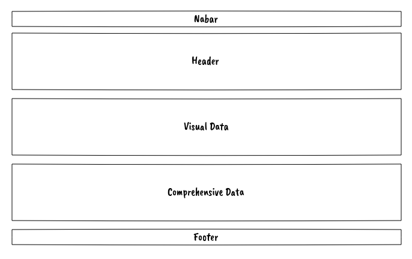

# Patrick's Covid19 Tracker

In this document I will attempt explain the process I went trough in thinking, planning and developing this project by utilizing industry standard methodologies.

---

## UX Design

For this project, I've adopted the methodology of the five planes of UX, which cosist of:

- Strategy
- Scope
- Structure
- Skeleton
- Surface Design

> “The Elements of User Experience” book written by Jesse James Garrett, one of the founders of Adaptive Path, a user experience consultancy based in San Francisco.

### Strategy

As the pandemic of Covid19 has changed the way we live, work and interact socially, I wanted to contribute to the world by providing a medium to inform and update people on the seriousness of this virus, while ensuring the that the data is presented in an easy to understand way without any additional clutter or information overload.

#### User Stories

I have consulted with several potential end users on what would be the most important requirements/wishes for details available in this project. As there are several applications providing similar statistics for Covid19, I've quickly understood that a key differentiator for my project would be necessary for adoption.

Multiple users within my line of work:

- _"We want an one-stop page with all information"_
- _"We want to be able to compare countries"_
- _"We ware waiting for vaccination. Any data available?"_

Aggie, Business Owner:

- _"Data must come from a source I can trust"_
- _"I don't like to click trough several pages"_
- _"Cluttered sites are undersireable for me"_

Fernando, Advisor in IT industry:

- _"I want no clutter"_
- _"Daily stats must be in forefront"_
- _"I want to know my home country's data without having to click trough menus"_
  <br/><br/>

### Scope of this Project

- Consume Covid19 related data from a reputable source
- Display this data in an easy to understand and intuitive manner
- Present latest news related to Covid19 pandemic to the user
- User should be able to select display of data between Latest vs Total
  <br/><br/>

### Structure

- As visitors to website may or not be proficient in computer driving, decision was made to organize the website as a single site, seperated by 3 sections:
  - Visual representation of data
  - Comprehensive representation of data
  - Aditional/in-depth representation of data
- A Main navigation bar will be displayed on the top to allow user to navigate to sections and/or select datasets
- A Footer will be displayed in the bottom for aditional information on the project
  <br/><br/>

### Skeleton

To be adhere to the structure/phylosophy outlined above, the overall website should be divided into three sections as shown below:



Further development into wireframing and shaping the project can be found in [Wireframing the Project](./wireframes.md).
<br/><br/>

## Testing

- During the lifecycle of development, I've had several testing period of one week, which has been performed by the end users mentioned above in my User Stories section.

### Challenges during development and testing

- I have observed that documentation for Google GeoChart is not always up-to-date, specifically around the google.visualization function. This presented difficulties on how to feed the data from a live API source, which I've been able to overcome by feeding the live data to a seperate array with the format intended for method .arrayToDataTable

- Documentation for Google GeoChart recommends a callback function to be called on documentation load which never worked for me, as I've observed the world map being drwawn with empty data. I've been able to overcome this challenge with calling the draw GeoChart function within the function that processes the data API (crude approach but works!)

- MediaStack API returns a lot of duplicated news (sometimes 10+ in a row!), so I've had to attempt to filter duplicates out by comparing previous news to current news.

- MediaStack API returns null, .mp4, .mp3 and other files as "image" so feeding these in the  tag would present empty/broken images. I've been able to overcome this challenge by filtering and replacing the "image" string with a default/placeholder

- Data Tables are very diffult to deal with on mobile phones. I've yet to find a solution apart from hiding in mobile view (I prefer to keep the table as it is than hiding it). As I want to continue develop this project further, I will find a solution for this.

### Testing Variables

As my project consumes external APIs and processes the data into a format that would fit for purpose, I've centered the temporary storage of this data into global variables. If anything does not load or displays empty data, the end user can easilly pinpoint which global variable is missing data and provide feedback by running the following script in the browser's developer tools:

```
// Copy & Paste into Chrome/Firefox Console to check variables:

var errors = 0;
if(latestbyCountry.length === 0){
console.log('Error: latestbyCountry array is empty'); errors++;
}
else {console.log('OK: latestbyCountry')}
if(totalbyCountry.length === 0){
    console.log('Error: totalbyCountry array is empty'); errors++;
}
else {console.log('OK: totalbyCountry')}
if(newsAPI.length === 0){
    console.log('Error: newsAPI array is empty'); errors++;
}
else {console.log('OK: newsAPI')}
if(latestbyCountry.length === 0){
    console.log('Error: covidDataTimestamp array is empty'); errors++;
}
else {console.log('OK: covidDataTimestamp')}
if(covidLatestTableData.length === 0){
    console.log('Error: covidLatestTableData array is empty'); errors++;
}
else {console.log('OK: covidLatestTableData')}
if(covidTotalTableData.length === 0){
    console.log('Error: covidTotalTableData array is empty'); errors++;
}
else {console.log('OK: covidTotalTableData')}
if(jQuery.type(totalDeaths) === 'number' && totalDeaths > 0){
    console.log('OK: totalDeaths')
}
else {console.log('Error: totalDeaths is not a number or is empty'); errors++;}
if(jQuery.type(totalCases) === 'number' && totalCases > 0){
    console.log('OK: totalCases')
}
else {console.log('Error: totalCases is not a number or is empty'); errors++;}
console.log('Errors Found: ' + errors);
```

Steps to execute are:

1. In Google Chrome, Chromium or Firefox, press F12
2. Search for the option "Console" and open it
3. Copy and Paste the above script into the Console and press "Enter"
4. Observe the feedback in Console and check if "Errors found" shows 1 or 0
5. If errors are found, note the variable name mentioned above displaying any error

### Manual Testing

Users were asked to perform tests with the following setup:

- Mobile Phone (Preferentially Android or iPhone)
- Native Browsers (Chrome on Android and Safari on iPhone)
- Desktop (Firefox, Chromium based browser like Google Chrome or Microsoft Edge)

Steps:

1. Navigation Bar

   1. Click on "Total Numbers" and observe if World Map changes to the red map with total numbers displayed
   2. Click on "Daily Update" and observe if World Map changes back to orange map with daily numbers

2. News Section

   1. Observe if news are changing every few seconds
   2. Click on a news item (image or text) and observe if a new browser tab opens and navigates to the source of the link

3. Total Numbers

   1. Visual observation if Todays and Totals numbers are showing instead of "Loading"

4. World Map with Data

   1. Visual observation if map is showing some countries with color of orange or similar
   2. Hover over any country that has color of orange or similar and observe if country name and related stats are showing
   3. You may skip this step if not easilly identifyable: Hover over the country with the most case and observe if the numbers match with the legend that is displayed below the world map

5. Data Table

   1. Select a different value in "Show 10 entries" and observe if entries match on the table
   2. In the Search Box, enter your country name and observe if it gets filtered in the table
   3. Observe if the table pagination system works by clicking on the pagination of the bottom right side of the table

6. "Switch to" button
   1. When clicking the red "Switch To" button, observe if the world map changes to the promised data "Total Stats" or "Today's Stats" with a slide animation
